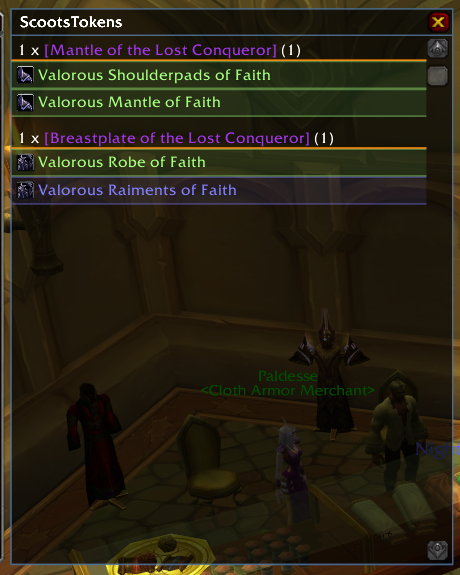
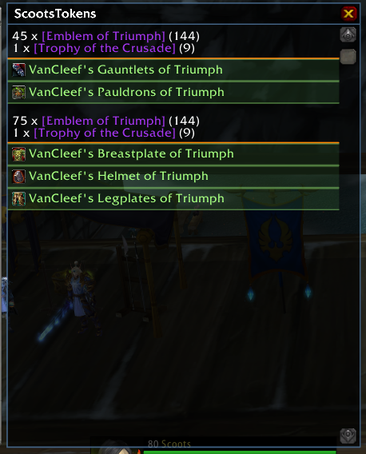
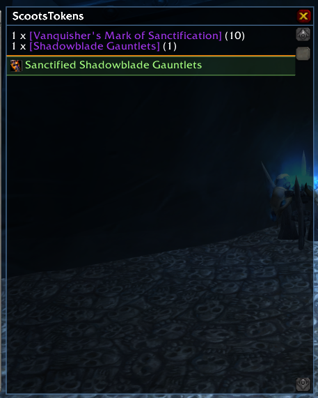

## Description ##

This addon will cause a panel to open next to vendors if any of the items they sell require items currently in your bags, grouped by the total cost.

## Installation ##

Download this repository, then extract the `ScootsTokens` subdirectory from the `src` directory into your `World of Warcraft/Interface/AddOns` directory.

## Screenshots ##

## Known issues ##

A group of items, or the entire ScootsTokens window will close if you can only afford to purchase one of an item, but after purchasing that item you would be able to make another purchase. This is caused by a race condition between the game reporting that an item has been purchased, and the item actually appearing in your bags.